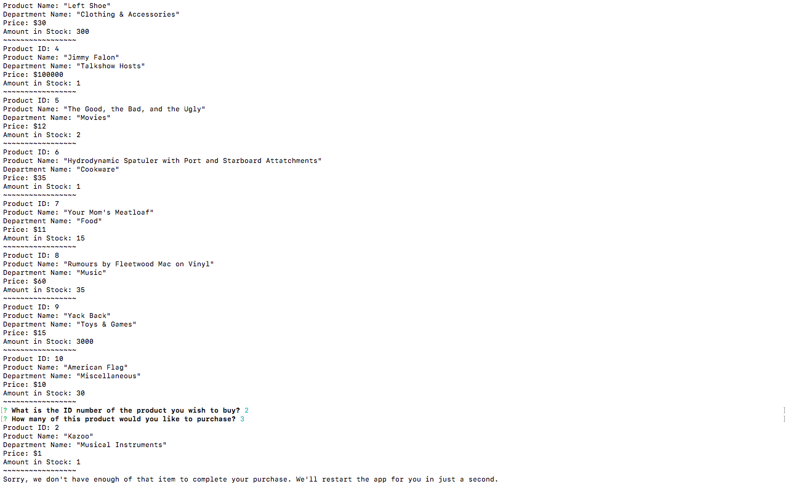
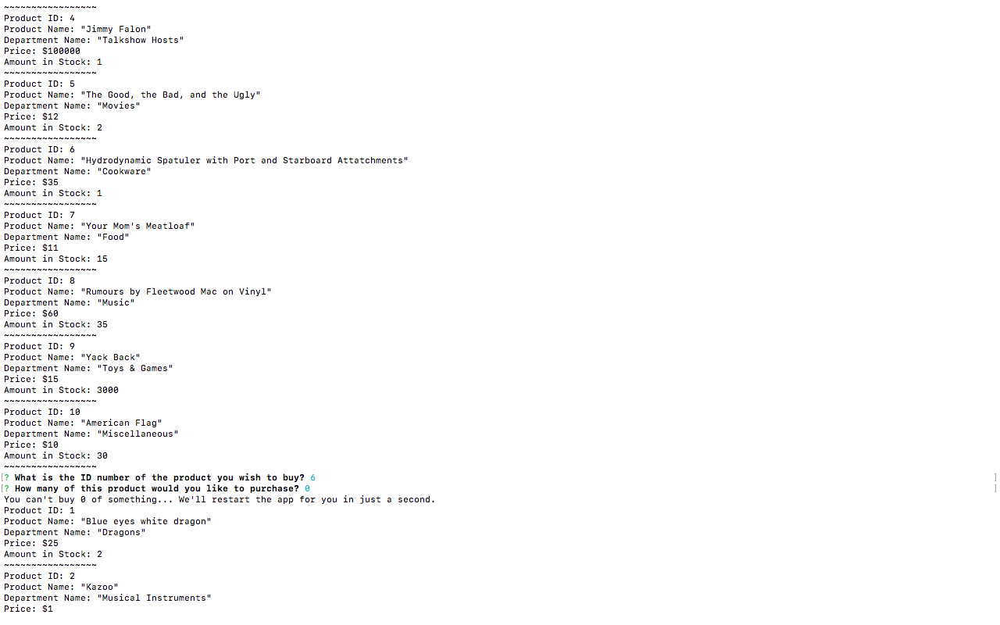
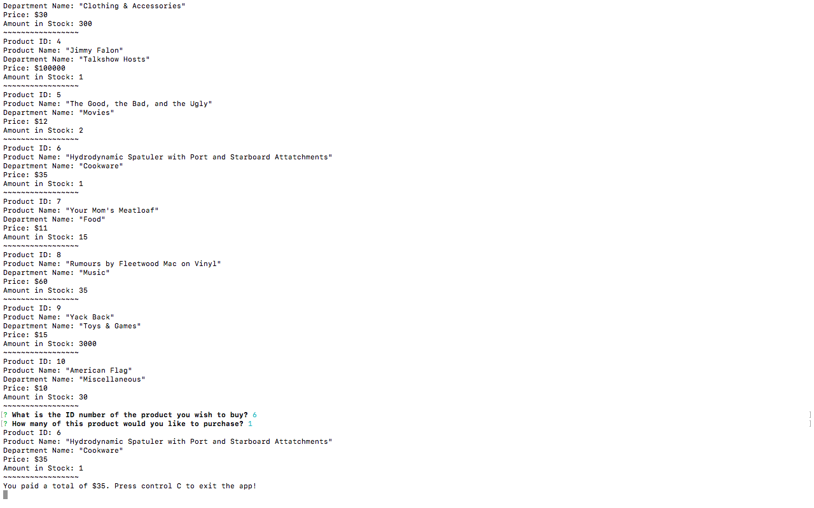
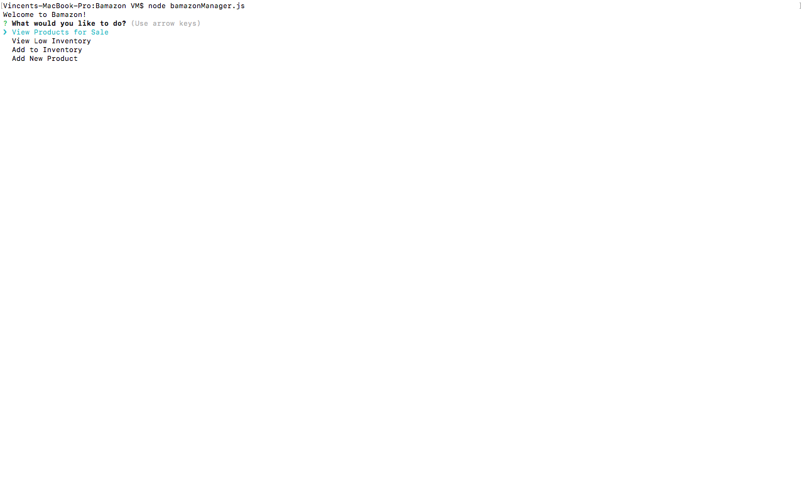
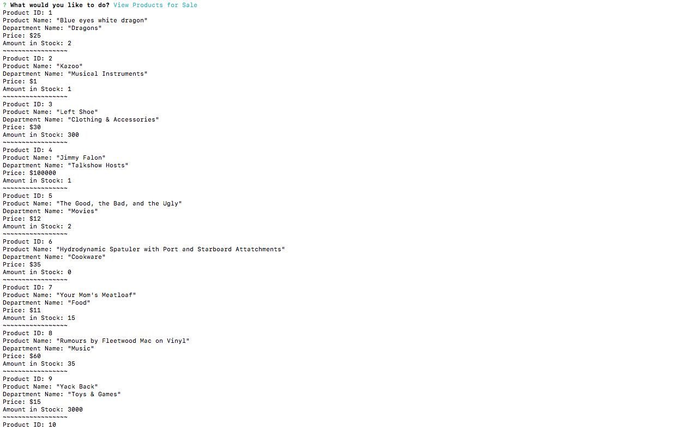
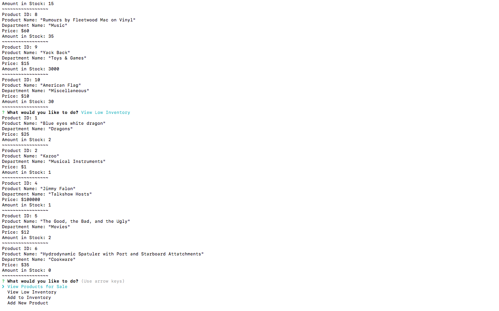
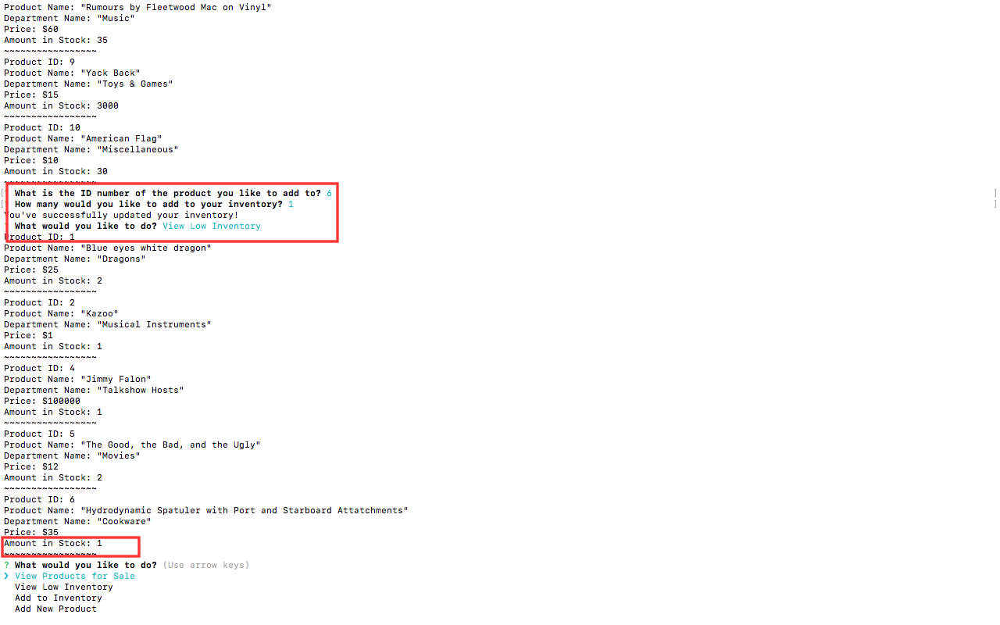

# Bamazon

## The following are from bamazonCustomer.js

### Shows what happens when a customer tries to buy more than what is in stock.

### Shows what happens when a customer accidentally tries to buy 0 of something.

### Shows what happens when a customer makes a successful purchase

## The following are from (the unfinished :( ) bamazonManager.js

### Everything in stock:

### Low inventory (Notice that Hydrodynamic Spatulae are not in stock, because we just bought one):

### Updating our stock successfully! We have one Hydrodynamic Spatula again.

